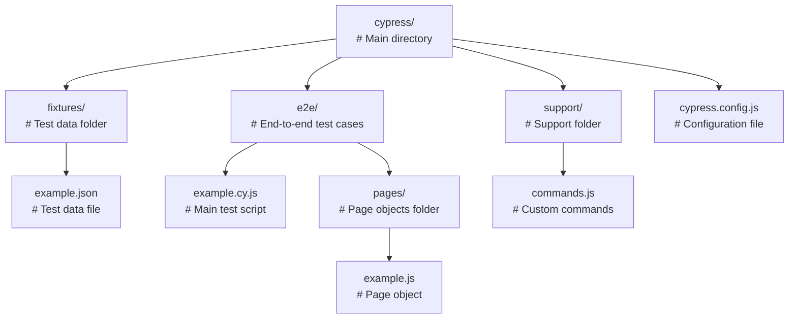
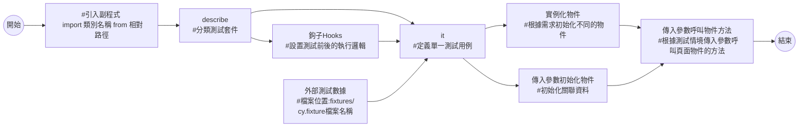
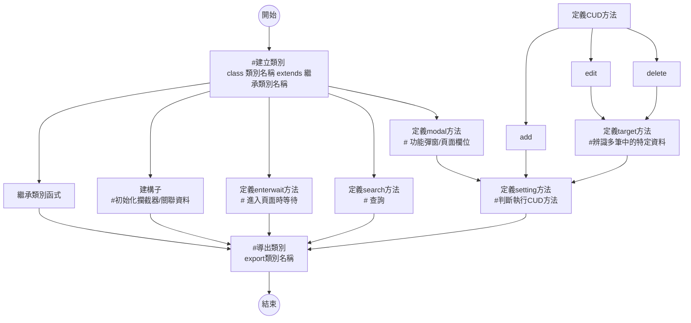

# nuHRM Cypress Testing
- **instructor:`Mars`**
- **author:`Don`**

## 結構

## 測試資料集
- 外部文件(file)
    - JSON 或 CSV 格式，用於儲存測試所需的靜態資料
    ```javascript
    // 載入員工資料
    cy.fixture('employeeData').then((employeeFixtureData) => {
        // 解構參數
        const {
            basicInfoData,
            contactInfoData,
            jobInfoData,
            ruleSettingData,
            DependentInfoData,
            familyInfoData,
            educationInfoData,
            skillInfoData,
            accountStatusData,
            exportDataData
        } = employeeFixtureData;
    });
    ```
- 主程式宣告全域物件
    - 動態資料
  
    ```javascript
    const clockData = {
        employeeId: 'NU2021004',
        user: '人力資源處 人資人xxxxxxxxxx4',
        action: '上班',
        message: '打卡成功',
        clockDate: '',
        clockTime: '',
        result: '成功',
        failureReason: '',
        ipAddress: '203.69.238.76',
        source: 'NUEiP 網頁打卡'
    }
    ```

    ```javascript
    it('上班打卡', () => {
        // 實例化 打卡鐘 類別
        const clock = new Clock(clockPolicyMgData);
        // 跳轉至首頁
        clock.navigate();
        // 獲取打卡鐘時間
        clock.gpsClockTime().then((time) => {
            console.log(`${time}`);
            // 儲存打卡鐘日期和時間
            [clockData.clockDate, clockData.clockTime] = time.split(' ');
            // 輸出打卡鐘日期和時間
            console.log(`日期: ${clockData.clockDate}, 時間: ${clockData.clockTime}`);
        });
    })
    ```
- 測試資料須具有關聯性
    - 單一模組測試C->R->U->D為一組測試週期
        - 新增資料 -> 查詢資料 -> 修改資料 -> 刪除資料
            - 查詢/修改/刪除操作所依據的數據指向新增資料的值，保持測試資料的一致性及關聯性
    ```javascript
    // 新增資料
    const addData = {
        mode: 'add',
        dept: '自動化測試',
        employee: 'test00003',
        sDate: '2024-01-01',
        eDate: '2024-12-31',
        leaveType: '育嬰留職停薪',
        seniorityAccrual: '繼續累計',
        remark: 'addTest'
    };

    // 查詢資料
    const searchData = {
        workStatus: '全部',
        dept: addData.dept,
        user: addData.employee,
        sDate: addData.sDate,
        eDate: addData.eDate,
    };

    // 編輯資料
    const editData = {
        mode: 'edit',
        employee: addData.employee,
        targetDate: `${addData.sDate} ~ ${addData.eDate}`,
        sDate: '2025-01-01',
        eDate: '2025-12-31',
        leaveType: '育嬰留職停薪',
        seniorityAccrual: '繼續累計',
        remark: 'editTest'
    };

    // 刪除資料
    const deleteData = {
        mode: 'delete',
        workStatus: '全部',
        employee: addData.employee,
        dept: addData.dept,
        user: addData.employee,
        sDate: editData.sDate,
        eDate: editData.eDate,
        targetDate: `${editData.sDate} ~ ${editData.eDate}`
    };
    ```

## 主程式(cy.js)

- Mocha測試框架
    - 使用 `describe` 來分類測試套件 (Test Suites)
        - 使用 `it` 來定義單一測試用例 (Test Case)
            - 宣告在 `describe 內且 it 外的變數`：
                - 在 describe 區塊內的所有 it 測試中都是全域變數
                - 所有 it 測試中都可以被訪問和修改
            - 宣告在`某個 it 內的變數`：
                - 變數的作用域僅限於該 it 測試
                - 只能在該特定的 it 測試中被訪問和使用，其他 it 測試無法訪問此變數
- 鉤子 (Hooks): 使用 `before`、`beforeEach`、`after` 和 `afterEach` 來設置測試前後的執行邏輯
    - `before` : 在當前 describe 區塊中的所有測試執行之前運行一次
    - `beforeEach` : 在當前 describe 區塊中的每個 it 測試執行之前運行一次
    - `after` : 在當前 describe 區塊中的所有測試執行之後運行一次
    - `afterEach`：在當前 describe 區塊中的每個 it 測試執行之後運行一次
- 實例化物件
    - 初始化物件
        - 在測試開始前，根據需求實例化不同的物件
        ```javascript
        // 實例化 員工資料 類別
        const employeeData = new EmployeeData();
        ```
    - 傳入參數初始化物件
        - 初始化關聯資料
        ```javascript
        // 主程式 - 實例化 打卡鐘 類別，傳入 Clock 類別的初始化資料，用於設定打卡規則
        const clock = new Clock(clockPolicyMgData);
        // 副程式 - 定義 Clock 類別
        class Clock extends Page {
            constructor(clockPolicyMgData) {
            // 繼承父類別
            super();
            // 設定打卡規則資料
            this.clockPolicyMgData = clockPolicyMgData;
            }
        }
        ```
    - 傳入參數呼叫物件方法
        - 在測試過程中，根據測試情境傳入參數呼叫頁面物件的方法
        ```javascript
        it('查詢', () => {
            // 實例化 打卡紀錄查詢 類別
            const clockInRecord = new ClockInRecord();
            // 跳轉至頁面
            clockInRecord.navigate();
            // 進入頁面等待
            clockInRecord.enterwait();
            // 進行查詢
            clockInRecord.menuSearch(searchData);
            // 驗證列
            clockInRecord.validateRow(clockData);
        })
        ```
## 副程式(.js)



- 類別
    - 建構子
        - 初始化物件的屬性，將傳入的參數賦值給對應的屬性
            - 初始化關聯資料
            ```javascript
            constructor(clockPolicyMgData) {
                // 打卡規則設定資料
                this.clockPolicyMgData = clockPolicyMgData;
            }
            ```

        - 設定攔截器`cy.intercept()`
            ```javascript
            constructor() {
                super();
                // 攔截請求
                cy.intercept('GET', `${Cypress.env('deptAcMg_url')}`).as('deptAcMg_GET');
                cy.intercept('GET', Cypress.env('deptAcMg_url') + '/*').as('deptAcMg*_GET');
                cy.intercept('POST', Cypress.env('deptAcMg_url') + '/*').as('deptAcMg*_POST');
                cy.intercept('PUT', Cypress.env('deptAcMg_url') + '/api/*').as('deptAcMg*_PUT');
                cy.intercept('DELETE', Cypress.env('deptAcMg_url') + '/api/*').as('deptAcMg*_DELETE');
            }
            ```
    - 方法
        - 解構賦值
            - 提高可讀性和可維護性
            ```javascript
            // 選單查詢
            menuSearch(data) {
                // 解構參數
                const {
                workStatus,
                dept,
                user,
                sDate,
                eDate,
                filter,
                } = data;
            }
            ```
        - 選擇器物件
            - 將前端元素宣告為選擇器物件
                - 依傳入參數設定所屬的選擇器物件
            ```javascript
            // 定義篩選元素的對象
            const filters = {
                '不篩選': 'notfilter',
                '曠職': 'absent',
                '遲到': 'late',
                '早退': 'leaveearly',
                '缺卡': 'missedpunch',
                '打卡異常': '_147_punch_abnormal_short'
            };

            // 根據傳入的參數從 filters 對象中獲取對應的選擇器值
            const filterValue = filters[filter];

            // 如果選擇器值存在，則查找對應的元素並進行點擊操作
            if (filterValue) {
                cy.get(`label[data-filter="${filterValue}"]`).click();
            }
            ```
        - modal
            - 功能彈窗/頁面欄位
                - 判斷是否須輸入欄位 `if(參數 !== 'null' && 參數 !== '')` 才進行欄位輸入
                ```javascript
                // 若參數傳入的 requestID 不是 'null' 且 request 不是空字符串,才進行欄位輸入
                if (requestID !== 'null' && request !== '') {
                    // 輸入單號
                    cy.get('input[name="request_number"]').clear().type(requestID);
                }
                ```
        - search
            - 查詢
              - 功能頁面查詢選單
        - 根據傳入的參數執行相應的動作
            - 使用 `switch...case` 依參數 `mode` 判斷執行 CUD 操作
                - Add(C)
                - target 指定資料列方法
                    - Update(U)
                    - Delete(D)
                      - 單欄位辨識多筆(列)中的特定資料
                      ```javascript
                      // 取得所有tr
                      cy.get('tr')
                          // 在table中找到包含特定員工編號的行
                          .contains(employeeId)
                          // 這個元素的父級行
                          .parent('tr')
                          // 限縮在此tr範圍
                          .within(() => {
                              // 確保日期、時間和類型都符合
                              cy.contains(Date);
                              cy.contains(Time);
                              cy.contains(Type);
                              
                              // 點擊刪除按鈕
                              cy.get('td[data-th="刪除"] i.DeleteBtn').click();
                          });
                      ```
                      - 多欄位辨識多筆(列)中的特定資料
                      ``` javascript
                      // 限縮表格範圍
                      cy.get('#table_content').within(() => {
                          // 獲取表格列
                          cy.get('tbody tr').each((row) => {
                            // 獲取當前td
                            const dateCell = row.find('td[data-th="日期"]').text().trim();
                            const timeCell = row.find('td[data-th="時間"] span').text().trim();
                            const gpsCell = row.find('td[data-th="GPS/定位資訊"]').text().trim();

                            // 檢查當前是否符合當前條件
                            if (dateCell === targetDate && timeCell === targetTime && gpsCell === targetGPS) {
                                // 符合點擊刪除
                                cy.wrap(row).within(() => {
                                    cy.get('td[data-th="刪除"] i').click();
                                })
                                // 停止迭代
                                return false;
                            }
                          });
                      })
                      ```
        - 在類方法中調用其他的類方法
            - 須使用`this`指向當前實例，否則js會查找全域函數而造成錯誤
        - 斷言 
            - Cypress 內建 Chai 的斷言庫，可以使用各種斷言來檢查測試結果
        - 動態等待
            - 進入頁面/方法完成須加上動態等待，確保請求完成
        ``` javascript
        // target特定列並根據模式執行
        targetRow(searchData, settingData) {
            // 解構參數
            const { description } = searchData;
            const { mode } = settingData;

            // 定義模式元素的對象
            const selector = {
                // 編輯
                edit: '.ctrl-edit',
                // 複製
                copy: '.ctrl-copy',
                // 刪除
                delete: '.ctrl-delete'
            }

            // 根據傳入的參數從 selector 對象中獲取對應的選擇器值
            const element = selector[mode];

            // 在table中找到包含特定名稱的列
            cy.get('tr')
                .contains(description)
                .parent('tr')
                .within(() => {
                    // 如果選擇器值存在，則查找對應的元素並進行點擊操作
                    cy.get(element).click();
                });

            // 若模式為刪除
            if (mode === 'delete') {
                // 定位刪除元素
                cy.get('.popover-content')
                    .should('exist')
                    .should('be.visible');
                cy.get('[data-answer="yes"]')
                    .wait(200)
                    .click();
            }
        }
        ```
        ``` javascript
        // 設定
        setting(searchData, settingData) {
            // 解構參數
            const { mode } = settingData;

            // 判斷模式
            switch (mode) {
                // 新增
                case 'add':
                    // 點擊新增
                    cy.get('.ctrl-add').click();
                    // 等待請求
                    cy.wait('@getHRInfo').then((xhr) => {
                        expect(xhr.response.statusCode).to.eq(200);
                    })
                    cy.wait('@orgTreePopOverAjax').then((xhr) => {
                        expect(xhr.response.statusCode).to.eq(200);
                    })
                    // 填寫彈窗
                    this.modal(settingData);
                    // 點擊儲存
                    cy.get('#save').click();
                    // 等待請求
                    cy.wait('@hrAuthApi_POST').then((xhr) => {
                        expect(xhr.response.statusCode).to.eq(200);
                    });
                    cy.wait('@hrAuthApi_GET').then((xhr) => {
                        expect(xhr.response.statusCode).to.eq(200);
                    });
                    break;
                // 編輯
                case 'edit':
                    // 在table中找到包含特定名稱的列並點擊編輯
                    this.targetRow(searchData, settingData);
                    // 填寫彈窗
                    this.modal(settingData);
                    // 點擊儲存
                    cy.get('#save').click();
                    // 等待請求
                    cy.wait('@hrAuthApi_PUT').then((xhr) => {
                        expect(xhr.response.statusCode).to.eq(200);
                    });
                    break;
                // 複製
                case 'copy':
                    // 在table中找到包含特定名稱的列並點擊複製
                    this.targetRow(searchData, settingData);
                    // 填寫彈窗
                    this.modal(settingData);
                    // 點擊儲存
                    cy.get('#save').click();
                    // 等待請求
                    cy.wait('@hrAuthApi_POST').then((xhr) => {
                        expect(xhr.response.statusCode).to.eq(200);
                    });
                    cy.wait('@hrAuthApi_GET').then((xhr) => {
                        expect(xhr.response.statusCode).to.eq(200);
                    });
                    break;
                // 刪除
                case 'delete':
                    // 在table中找到包含特定名稱的列並點擊複製
                    this.targetRow(searchData, settingData);
                    // 等待請求
                    cy.wait('@hrAuthApi_DELETE').then((xhr) => {
                        expect(xhr.response.statusCode).to.eq(200);
                    });
                    cy.wait('@hrAuthApi_GET').then((xhr) => {
                        expect(xhr.response.statusCode).to.eq(200);
                    });
                    break;
                default:
                    break;
            }
        }
        ```
        - 繼承
            - 使用其他檔案的類方法
- 自定義命令
    - 在 `support/commands.js` 中定義以實現測試重用性
    ```javascript
    // 定義一個自定義命令 enterLoginUat
    Cypress.Commands.add('enterLoginUat', (company, employeeId, password) => {
        // 使用 cy.session() 開啟一個新的Cypress會話，並傳遞公司名稱、用戶名和密碼
        cy.session([company, employeeId, password], () => {
        // 訪問設定的登錄URL，從 Cypress 環境變數中取得
        cy.visit(Cypress.env('login_url'));
        // 輸入公司代碼
        cy.get('input[name="inputCompany"]').first().type(company);
        // 輸入員工編號
        cy.get('input[name="inputID"]').first().type(employeeId);
        // 輸入密碼
        cy.get('input[name="inputPassword"]').first().type(password);
        // 點擊登入
        cy.get('.login-button').first().click();
        });
    });
    ```
    - 呼叫自定義命令
    ```javascript
    cy.enterLoginUat(
    "don0105",
    "NU2021004",
    "888888"
    );
    ```
- 配置文件(config)
    - 設置 `baseUrl` 
    - 環境變數
    ```javascript
    module.exports = defineConfig({
        e2e: {
            baseUrl: 'https://hrm.uat.nueip.site'
        },
        env: {
            home_url: '/home'
        }
    });
    ```
     - baseUrl 為 `https://hrm.uat.nueip.site/`，當在測試中使用 `Cypress.env('home_url')` 作為路徑時，Cypress 會自動將它解析為 `https://hrm.uat.nueip.site/home`

## 最佳實踐
- `單一職責原則`： 每個類別只負責一個明確且獨立的職責。每個Page Object只專注於管理特定網頁或元件的交互操作（單一HRM頁面），從而確保程式碼的清晰性和可維護性
- `模組化`： POM將整個自動化測試程式劃分為獨立的、可重用的部分，每個部分是一個Page Object。使得在不同的測試案例中可以重複使用相同的Page Objects，同時也便於新增和修改功能
- `方法分解`： 當一個方法變得過於龐大或者功能過於複雜時，應該將其拆分成多個更小、更具體的方法

## 執行模式
- GUI
```bash
npx cypress open
```
- CLI
```bash
npx cypress run –-spec "<file1>,<file2>,…,<fileN>"
```
## 範例 - 主程式
- [留職停薪管理 - CRUD資料 : `C->R->U->D為一組測試週期`](https://github.com/nueip/don-cypress/blob/main/cypress/e2e/Lwop.cy.js)
- [員工資料 : `fixture載入外部測試集`](https://github.com/nueip/don-cypress/blob/main/cypress/e2e/EmployeeData.cy.js)
    - [`外部測試集`](https://github.com/nueip/don-cypress/blob/main/cypress/fixtures/employeeData.json)

## 範例 - 副程式
- [出勤紀錄 - 選單查詢 : `選擇器物件`](https://github.com/nueip/don-cypress/blob/main/cypress/e2e/Pages/AttendanceRecord.js) 
- [人資身分資料權限管理 : `CRUD判斷 / target指定資料列`](https://github.com/nueip/don-cypress/blob/main/cypress/e2e/Pages/HrAuthSetting.js)
- [員工資料 : `方法分解`](https://github.com/nueip/don-cypress/blob/main/cypress/e2e/Pages/EmployeeData.js)

# cypress
- 訪問指定的 URL
```
cy.visit('https://URL/');
```
- 搜尋    * ID(# )   *class(. ) *name([ ])
```
.get('  ') 
```
- 點擊被隱藏的屬性          
```
.click({ force: true });
```
- 過濾器        
```
.then((xhr) => { });
```
- 選取關鍵字 
```
.contains('class','data')
```
- 選擇選單內容(強制輸入)      
```
.select(' ', { force: true });
```
- 順位
```
.eq()
```
- 等待
```
.wait();
```
- 嚴格判斷
```
.should('be.visible')
```
- 找到外框
```
.within(() => { })
```
- 輸入x值加enter動作     
```
.type('x{enter}')
```
刪除內容     
```
.clear()
```
